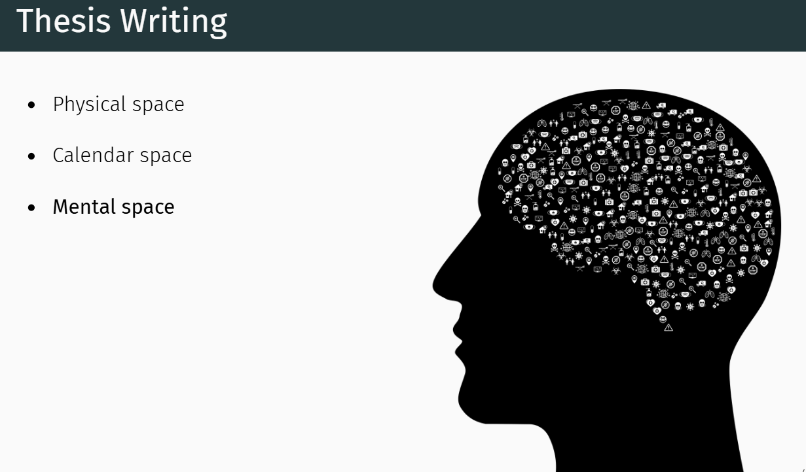

```{r setup, include=FALSE}
options(htmltools.dir.version = FALSE)
knitr::opts_chunk$set(
  fig.width=9, fig.height=3.5, fig.retina=3,
  out.width = "100%",
  cache = FALSE,
  echo = TRUE,
  message = FALSE, 
  warning = FALSE,
  hiline = TRUE
)
```

```{r xaringan-themer, include=FALSE, warning=FALSE}
library(xaringanthemer)
style_duo_accent(
  primary_color = "#253494",
  secondary_color = "#c7e9b4",
  inverse_header_color = "#a1d99b"
)
```

<style type="text/css">
.remark-slide-content {
    font-size: 30px;
    padding: 1em 4em 1em 4em;
}
</style>

# What is Scientific Writing and Communication?


Scientific writing and communication refer to the skills and practices involved in effectively conveying scientific information to various audiences. 

---

# Importance of scientific writing

1. Sharing your research

2. Reproducibility

3. Funding and career advancement

3. Public engagement

---

# Types of Scientific Documents

## Where do we find scientific writing?

---

# Practical tips and tools?

- Use simple, straight forward language

- Use clear headings and subheadings

- Always revise your work and seek feedback

- Use a plagiarism checker


---
## Papers selected for discussion today

1. [A Layered Grammar of Graphics](https://www.tandfonline.com/doi/epdf/10.1198/jcgs.2009.07098?needAccess=true)

2. [Forecasting: theory and practice](https://www.sciencedirect.com/science/article/pii/S0169207021001758)

3. [Forecasting with temporal hierarchies](https://www.sciencedirect.com/science/article/abs/pii/S0377221717301911)

4. [Meta-learning how to forecast time series](https://onlinelibrary.wiley.com/doi/abs/10.1002/for.2963)

5. [A Hexagon Tile Map Algorithm for Displaying Spatial Data](https://journal.r-project.org/articles/RJ-2023-021/)


6. [Calendar-based graphics for visualizing...](https://pdf.earo.me/calendar-vis.pdf)

7. [A Projection Pursuit Forest Algorithm for Supervised Classification](https://www.tandfonline.com/doi/epdf/10.1080/10618600.2020.1870480?needAccess=true)

---

# Research papers/ Journal Article /Manuscript (before publication)/ Scholarly Article

---

# Review the articles shared today
# What writing structures do they follow?

---

# Examine the articles shared today

# In what ways do their purposes and contents differ?

---

# Selecting good papers

In-class demo

---

## Writing introduction

**Hook**

A compelling opening sentence or idea to grab the reader's attention.

---
## Types of hooks

**1. Statistic or Fact Hook**

Start with a surprising or impactful statistic or fact related to your topic.

Example:

Over 80% of the world’s wastewater is released into the environment untreated, affecting millions of people daily.

---

## Types of hooks (cont.)

**2. Question Hook**

Begin with a thought-provoking question to engage the reader.

---
## Types of hooks (cont.)

**3. Quotation Hook**

Use a relevant and powerful quote from a well-known figure or authoritative source.

Example:

In 1976, a British statistician named George Box wrote the famous line, “All models are wrong, some are useful.

---
## Types of hooks (cont.)

**4. Anecdotal Hook**

Start with a brief personal story or anecdote that illustrates the issue.

Example:

When I first visited the rural village, I noticed children walking miles to access clean water—a reality for millions across the globe.

---
## Types of hooks (cont.)

**5. Historical Hook**

Begin by referencing a historical event or background related to the topic.

Example:

In 1854, John Snow mapped a cholera outbreak in London—marking the birth of modern epidemiology. Today, we face similar challenges with disease mapping in developing nations.

---
## Types of hooks (cont.)

**6. Contrasting Statement Hook**

Present a contradiction or surprising contrast to pique curiosity.

Example:

Despite technological advancements, rural students in many countries still lack access to basic educational resources.

---
## Types of hooks (cont.)

**7. Definition Hook**

Define a term or concept that is central to your topic, especially if it has varied meanings.

Example:

Machine learning interpretability refers to the degree to which a human can understand the reasoning behind a machine learning model's predictions.

---
## Other components - Introduction


1. Background / Context

2. Problem Statement

3. Review of Key Literature (optional in short papers)

4. Research Aim / Objective

5. Research Questions or Hypotheses (if applicable)

6. Significance of the Study

7. Overview of the Paper / Structure 

---

## Types of Background in a Research Introduction

1. Thematic Background

2. Contextual Background

3. Conceptual Background

4. Methodological Background

5. Problem-Oriented Background

6. Literature-Based Background

7. Policy or Practice-Based Background


---
## Scientific writing with overleaf

Sign up at https://www.overleaf.com/

---

# Lecture 2

[Forecasting and trading on the VIX futures market: A neural network approach based on open to close returns and coincident indicators](https://www.sciencedirect.com/science/article/abs/pii/S0169207019301372)

[Prediction of the Indian summer monsoon using a stacked autoencoder and ensemble regression model](https://www.sciencedirect.com/science/article/abs/pii/S0169207020300479)

---
#  Different structures to break down the background section

---

## Application work

- Introduction to the Practical Problem


- Existing Methods / Technologies


- Gap in Application / Practice


- What This Paper Does (Your Approach)


- Significance of the Study


- Structure of the Paper

---

## Theoretical Papers

- Introduction to the Theoretical Area


- Review of Key Existing Theories/Models


- Theoretical Gap / Unresolved Issues

- What You Do (Main Theoretical Contribution)


- Significance of the Contribution


- Structure of the Paper

---

## Review Papers


- Context and Motivation for the Review

- Scope of the Review

- Existing Reviews and Their Limitations

- What You Do in This Paper

- Significance of the Review


- Structure of the Paper

---

# Topic sentence 

Topic sentence is the first sentence of a paragraph that introduces the main idea or focus of that paragraph

----

# Topic sentence: Purpose

- It tells the reader what the paragraph is about.

- It acts as a guide for both the writer and the reader.

- It helps with clarity, flow, and coherence in your writing.

---
## A good topic sentence is:

- Clear and specific (not too broad or vague)

- Often connects to the previous paragraph (transition)

- Often introduces a claim or idea that the rest of the paragraph explains or supports

---
## Hook vs. Topic Sentence

In-class discussion

---

## Transition strategies

---


- Introduction → Gap in Knowledge

    "However, despite these advances, several challenges remain."

- Gap → What You Do

    "To address this gap, we propose..."

- What You Do → Significance

    "This contribution is significant because..."

- Significance → Structure of the Paper

    "The remainder of this paper is organized as follows:"
    
---

## Literature Review

---
## What are the purposes of a literature review?

- To learn what has already been done

- To identify gaps and opportunities

- To ensure you're not just repeating what others have already done

- To familiarize yourself with the current state of knowledge on your topic

---
## How can I access published research papers?

- Academic databases and search engines

- Speak with the librarian at your institution to find out if you have access to any subscription databases

---
## Free databases/ search engines

- Google scholar

- Directory of Open Access Journal (DOAJ)

- PubMed

- Bielefeld Academic Search Engine (BASE)

- E-Theses Online Service (EThOS)

---
## Free databases/ search engines (cont.)

- Social Science Research Network (SSRN)

- WorldWideScience

- Semantic Scholar - “intelligent” academic search engine. Machine learning algorithm is used to prioritize the most important research

- Public Library of Science (PLOS)

---
## Free databases/ search engines (cont.)

- Microsoft Academic Search

- Dimensions

---
## Databases that are available through subscription

- Scopus

- Web of science

---

If you can access the full text of a paper, it could be because of a number of reasons, for example

- Open access

- Authenticated user

- Author-archived copy

---
## Dealing with paywalls

- Speak with the librarian

- Write to the corresponding author

- Use unpaywall to see if there is an open access version of the full text of the paper

---
## What is unpaywall?

Browser extension that will automatically point out full text or open-access version of research papers

Example: https://unpaywall.org/

---
## Preprints and repositories

- arXiv

- bioRxiv

- Institutional repositories

- OpenDOAR website

---
##  Ways to structure a literature review

 1. Thematic Structure (by topic/theme)
 
 2. Chronological Structure (by time)
 
 3. Methodological Structure (by method/model)

---
# Lecture 3
---
## What are the different types of review? 

- Systematic Reviews

- Meta-Analyses 

- Umbrella Reviews

- Scoping Reviews

- Rapid Reviews

- Narrative Reviews

---
## Grey literature

- information and research materials that are produced outside of traditional academic publishing channels.

---

## Your turn

Find pros and cons of grey literature

Reading: [Doing a Systematic Review: A Student's Guide](https://books.google.lk/books/about/Doing_a_Systematic_Review.html?id=voTCEAAAQBAJ&redir_esc=y)

---

## Writing Literature Review Section

1. Introduction

2. Decide how you will organize the literature? Chronological, Thematic, Methodological

3. Conclusion

  - Summarizing main findings

  - Highlighting research gaps

  - Justifying the need for your study (if applicable)

  - Suggesting directions for future research
 
--- 
#
---

## Literature Review: Writing style 1

1. Summarize what they found

2. Discuss other similar studies

3. Present your argument

In-class: Example writing

---

## Literature Review: Writing style 2

1. Introduce the study

2. Elaborate on the findings

3. Highlight gaps and controversies

4. Introduce your argument or contribution

In-class: Example writing

---

## Methodology

- Introduction

- Data description

- Data preprocessing

- Feature engineering

-  Methodological framework 

- Tools and software

- Evaluation metrics

- Justification for assumptions and limitations

---

## Other sections in a research paper

- Results

- Conclusions and Discussion

---

## Research Ethics

Click on slides [here](https://thiyanga-scientificwriting.netlify.app/slides/4_lr/5_ethics#1)

---

## Thesis Writing

Q: "Identify the differences in writing style."

1. [Integrating Omics Data: A New Software Tool and its Use in Implicating Therapeutic Targets in
Huntington’s Disease](https://dspace.mit.edu/handle/1721.1/119026)

2. [AI-assisted evaluation of large language models](https://searchworks.stanford.edu/view/in00000382107)

3. [Deep learning for processing histopathology images](https://pureadmin.qub.ac.uk/ws/portalfiles/portal/238764526/thesis.pdf)
---

# Thesis Writing

---


---


---



---


---


## Grammar of Graphics

[ggplot vs plotnine](Managing Citations: EndNote, Zotero, Mendeley)

---

## Introduction to reproducible documentation with RMarkdown and Quarto

In-class practical session

---
# Lecture 4

---
# Writing an abstract

---
## What is an abstract?

An abstract gives an overview of your entire research project and usually answers these questions: 

What is your research about? 

Why is it important? 

How did you do it? 

What did you find? 

Why are your findings important? 

---

## What is the purpose of an abstract?

1. Summarizes the study – Gives a brief overview of what the research is about.

2. Helps readers decide – Lets people see if the research is useful to them before reading the whole paper.

3. Gives a quick guide – Shows what to expect in the full article or thesis.

---

## Structured Vs Unstructured Abstract

**Structured Abstract**

Format: Divided into labeled sections (e.g., Background, Methods, Results, Conclusion).

**Unstructured Abstract**

Format: Written as one single paragraph without section headings.

---

## Don'ts in Abstracts:

- No abbreviations – Avoid using short forms unless they are very common and well-known.

- No citations – Don’t refer to other studies or include references.

- No figures or tables – Keep it all in text form only.

- No lengthy background – Be brief and to the point.

- No detailed methods – Only include essential information.

**Keep it clear, concise, and self-contained.**

---

##  Examples

Structured Abstract

[An 8-gene machine learning model improves clinical prediction of severe dengue progression](https://link.springer.com/article/10.1186/s13073-022-01034-w)

Unstructured Abstract

[https://www.sciencedirect.com/science/article/pii/S266682702100102X](https://www.sciencedirect.com/science/article/pii/S266682702100102X)

---

## The language of abstracts

1. Background: Present

2. Purpose: Present

3. Methods: Past

4. Results: Past

5. Discussion and Conclusions: Present

---

Background – Present tense
Example: "Dengue is a major public health concern in tropical regions."

Purpose – Present tense
Example: "This study aims to analyze the seasonal patterns of dengue incidence."

Methods – Past tense
Example: "Data were collected from hospital records between 2010 and 2020."

Results – Past tense
Example: "The analysis showed a peak in cases during the monsoon season."

Discussion and Conclusions – Present tense
Example: "The findings suggest that weather patterns influence dengue outbreaks."

---

## Tenses for Thesis Chapters
---

## 1. Introduction

 Present Tense – For current knowledge, context, and your research aim
Use it when talking about the current situation, known facts, and your study goals.

"Dengue is a major health problem in tropical countries."

"This study aims to explore the link between climate and dengue incidence."

"There is a lack of research on early-warning systems for outbreaks."

“Dengue is a growing concern in urban areas.”

---

Past Tense – For specific past research or historical background
Use it when describing what other researchers have already done.

"Kumar (2017) investigated the relationship between rainfall and mosquito density."

"In 2010, the government launched a national surveillance system."


 “Smith (2020) found a strong correlation between rainfall and dengue cases.”
 
---
Present Perfect – For summarizing past work with relevance to the present
Use it to highlight gaps or progress in research over time.

"Several studies have examined the seasonal patterns of dengue."

"Few researchers have addressed the role of urban planning."

---

## 2. Literature Review

Past tense: When discussing specific past studies.
Example: “Lee (2018) examined hospital records from 2005 to 2015.”

Present perfect: To show general trends or gaps.
Example: “Many studies have focused on climate-related factors.”

Present Tense — For general truths or accepted facts
Use when stating something that is still true or widely accepted.

"Dengue is transmitted by Aedes mosquitoes."

"The climate plays a key role in disease transmission."

---
## 3. Methodology

Past tense: Describes what you did.
Example: “Data were collected from three districts using a survey.”

---
## 4. Results

Past tense: Reporting your findings.
Example: “The model predicted 85% of the cases accurately.”

---
## 5. Discussion

Present tense: Interpreting your results.
Example: “These results indicate a seasonal pattern.”

Past tense: When referring to your results or earlier research.
Example: “This finding was also observed in the 2019 study.”

---

## 6. Conclusion

Present tense: Summarizing and emphasizing your key message.
Example: “This study shows that rainfall is a key predictor of dengue.”

---

# Tenses to Use When Interpreting Tables and Figures in a Thesis

---

**Refer to the table/figure itself – Use present tense**

Example:

"Table 2 shows the monthly dengue incidence."

"Figure 3 illustrates the relationship between temperature and case count."

---

**Describe what the data reveals – Use past tense**

Example:

"As shown in Figure 1, dengue cases increased sharply in January."

"The data in Table 4 indicated a significant drop in mosquito density."

---

**Interpret or generalize from results – Use present tense**

Example:

"These results suggest a seasonal pattern of transmission."

"The findings support the hypothesis that rainfall affects disease spread."

---
# Abstract: Opening sentences to engage readers

---

##  Highlight a real-world problem

Start with the issue your research addresses.

Example:

“Dengue fever remains a major public health threat in tropical and subtropical regions.”

---

## Use a striking fact or statistic
Grab attention with a data point.

Example:

“Over 390 million dengue infections occur annually, yet early detection remains a challenge.”

---

## State a knowledge gap or limitation
Show what’s missing in current research.

Example:

“Despite extensive research on dengue, few studies have explored its spatio-temporal patterns in rural areas.”


---
## Pose a critical question
Raise a research question that your study answers.

Example:

“What climatic factors most strongly influence dengue outbreaks in urban environments?”

---

## Start with a general-to-specific approach
Begin broadly, then narrow into your study.

Example:

“Vector-borne diseases are sensitive to environmental changes. This study examines the link between rainfall patterns and dengue incidence in Sri Lanka.”

---

## Types of abstracts

1. Conference Abstracts

2. Video Abstract

3. Graphical Abstract

4. Research Article Abstract

5. Thesis Abstract

---

## Highlights vs. Abstracts

Highlights are the ‘elevator pitch’ of your article. They are the three to five bullet points that will help increase the discoverability of your article via search engines.   

---

# Tips for Writing Effective Highlights

Example: [https://www.sciencedirect.com/science/article/abs/pii/S0013795221004671](https://www.sciencedirect.com/science/article/abs/pii/S0013795221004671)
---

- Keep them short and clear

- Focus on key findings or contributions

- Use plain language

- Be specific and informative

- Avoid full sentences if possible

- Include keywords

- Avoid abbreviations and acronyms

- No citations or references

- Keep highlights standalone

---

## Tools for Graphical Abstract

[https://tidbitapp.io/](https://tidbitapp.io/)

---

## Active Listening

Not Just Absorbing Like a Sponge:

Active listening isn’t about passively taking in everything said. Instead, it involves engaging your mind, processing the information, and responding thoughtfully.

[Reading](https://kentruongphysiotherapy.wordpress.com/2016/10/11/active-listening/)

---

## Thinking Hard: Cognitive Load Theory

Understanding how people process information is essential in scientific writing and presentations. Cognitive load refers to the amount of mental effort required to process information.

Intrinsic cognitive load

Extraneous cognitive load

Germane cognitive load

Thinking hard and motivation

---

## Business Insight
Generating new ideas in scientific contexts requires a structured approach to creativity.

Preparation

Incubation

Illumination

Verification

---

## Presentation skills

- Preparing for a presentation

- Organizing the presentation material

- Writing the presentation

- Deciding on the presentation method

- Working with Visual Aids

---
## Preparing a Research Presentation: Common Challenges

 1. Selecting the Right Content
 
 2. Time Management
 
 3. Audience Understanding
 
 4. Visual Design Issues
 
 5. Nervousness / Speaking Anxiety
 
 6. Handling Difficult Questions
 
In-class: How to Address Common Research Presentation Challenges


---
## Structure for a Research Presentation
---
### 1. Title Slide

Project title, your name, institution, date.

### 2. Introduction

- Brief background

Research problem or gap

- Objectives or research question

---

### 3. Methods

Study design, data collection, analysis approach

Keep it visual and concise

---

### 4. Results

Highlight key findings with graphs/tables

Focus on patterns or takeaways, not all data

---

### 5. Discussion

Interpret results in context

Compare with existing research

Mention limitations briefly


### 6. Conclusion
Summarize main findings

Implications or next steps

End with a clear take-home message

---

### 7. Acknowledgements (Optional)
Funders, collaborators, institutions

### 8. Q&A Slide
Simple “Thank You” or “Questions?” with your contact info

---
## Effective Research Presentation Tips

1. Go from Known to Unknown

2. Keep It Simple and Clear

3. Use Visuals Wisely

4. Practice with a Timer

5. Know Your Audience

6. Start Strong, End Strong

7. Use Storytelling

8. Be Prepared for Questions

---

## Example Presentation

[Example](https://thiyangt.github.io/whyR2021keynote/#1)

---

## Storytelling in Research Communication

“Facts tell, but stories sell.” — Storytelling makes your research memorable, relatable, and impactful.

Storytelling in research is not about gossip or casual talk — it’s a purposeful communication tool used to engage, explain, and persuade.

---

# Example Story Telling Process

---

**Set the Scene**
– Give context (When? Where? Who? Why?)
Example: “In 2019, a small town in Sri Lanka experienced its worst dengue outbreak…”

**Introduce the Problem**
– What went wrong? What challenge existed?
Example: “Despite existing mosquito control efforts, the number of cases kept rising.”

**Describe the Journey**
– What did you do? How did you explore or solve it?
Example: “We collected climate and health data across 12 districts and built a forecasting model…”

---

**Deliver the Outcome**
– What did you find or change?
Example: “The model predicted outbreaks 3 weeks in advance with 90% accuracy.”

**Reflect on the Meaning**
– Why does it matter? What’s next?
Example: “This approach could help prevent outbreaks in vulnerable regions.”
---

## Effective Storytelling Hooks for Research

In-class-discussion

---

# Properties of a Good Story

---

**Clear Purpose**

The story supports your main message or research objective.

Every part of the story should guide the audience toward understanding your key point.

Example: A story about a disease outbreak that introduces your forecasting model.

---

**Relatable Characters or Context**

Audiences connect better when there are people or situations they can identify with.

In research, this could be a patient, a researcher, a village, or a decision-maker.

Example: “A local health officer was overwhelmed when dengue cases surged…”

---

**Conflict or Challenge**

Good stories have a problem to solve or a question to answer.

In research, this is often the research gap or the real-world problem you’re addressing.

Example: “Despite spraying, dengue cases kept rising…”

---
**Resolution or Discovery**

The story shows how the problem was tackled, ideally ending with a solution, insight, or lesson learned.

Example: “By integrating weather data into our models, we improved outbreak predictions by 80%.”

---

**Emotional or Intellectual Engagement**

The story should make the audience feel something (curiosity, empathy, urgency) or think deeply.

Tip: Use vivid language, real numbers, or human outcomes to increase impact.

---

**Structure (Beginning, Middle, End)**

A good story has a logical flow:

Beginning: Sets the scene

Middle: Builds the problem/conflict

End: Delivers insight or resolution

---
## Research Poster

Title: Clear, concise, and descriptive.

Authors and affiliations: Make sure these are easy to find.

Introduction/Background: Briefly set context.

Objectives/Aims: State what your research questions or goals were.

Methods: Summarize your approach—focus on clarity, not detail.

Results: Use visuals (charts, graphs, tables) to show key findings.

Discussion/Conclusions: Highlight implications, significance, and next steps.

References: Cite important works, keep it minimal.

Acknowledgments: Funding, contributors.
